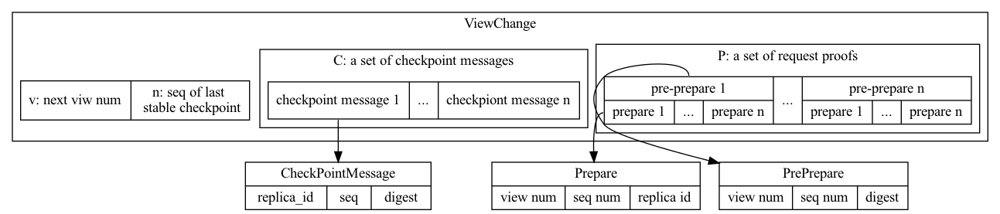
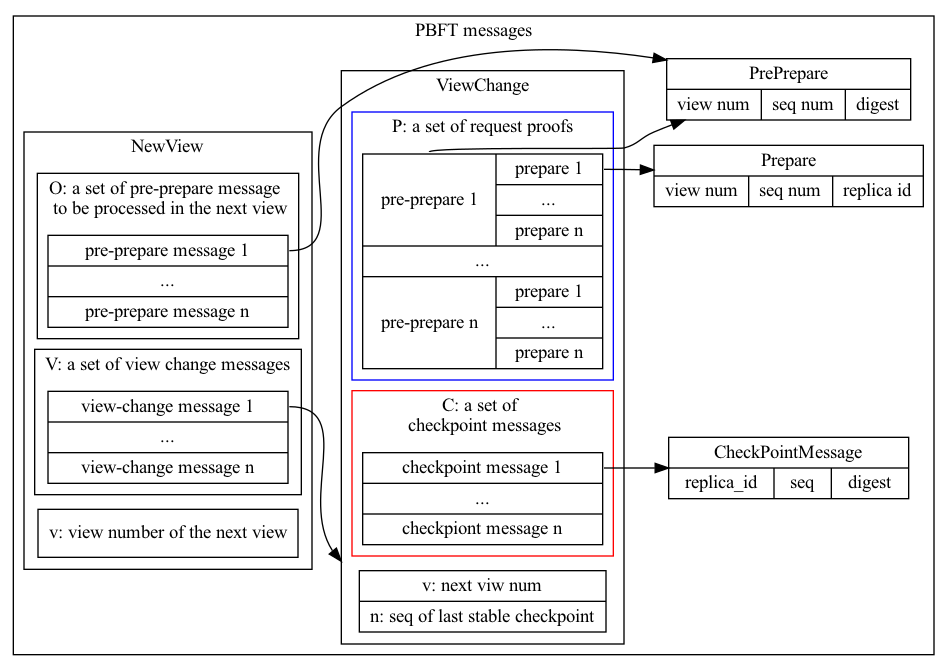

# Table of Contents

- [A brief introduction to PBFT](#A-brief-introduction-to-PBFT)
   - [Concepts](#Concepts)
   - [The protocol](#The-protocol)
- [Design of the system](#Design-of-the-system)
   - [Integrate into Substrate](#Integrate-into-Substrate)
   - [Stages of a replica](#Stages-of-a-replica)
   - [Caching requests](#Caching-requests)
   - [Stage changing](#Stage-changing)

This project implements [PBFT(Practical Byzantine Fault Tolerance)](https://pmg.csail.mit.edu/papers/osdi99.pdf) protocol and integrates it into [Substrate framework](https://substrate.io/) as a finality gadget.

**Build & Run**
```shell
cargo build --release
cargo run --release -- --dev
```

## A brief introduction to PBFT
This section briefly reviews the concepts and protocols involved in PBFT. For more details, please refer to the original [paper](https://pmg.csail.mit.edu/papers/osdi99.pdf).

### Concepts
A PBFT system is composed of multiple nodes(replicas) that are connected with each other through the network. The system requires at least `3f + 1` replicas to provide safety and liveness, where `f` is the maximum faulty replicas expected. **Requests** in a PBFT system are any subjects that the user of the system wants to reach a consensus on. In the context of the blockchain, a request is a block sent to the PBFT system. As described in the paper, a request is multicasts by the primary to the backups, in practice, it may not necessarily be the case. For example, in a network run by Substrate nodes, each replica can receive requests/blocks from its upstream block import.

The PBFT protocol divides the time period into a continuous sequence of slices named *views*, each of whom has a unique view number. A view is further divided into smaller pieces named sequences, each *sequence* is according to a request. For each view, there’s a *primary replica* while all other replicas are *backups*. The primary replica is responsible to start the consensus process for requests. Once the primary is considered by a majority of replicas as malicious, the system starts a *view change*, during which a new primary will be selected and the system moves on to the next view.

### The protocol
The PBFT protocol contains 3 major parts:
- normal-case operations: describes how replicas interacts with each in **pre-prepare** , **prepare** and **commit** phases
- checkpoint: a mechanism for garbage collection, i.e. truncate old PBFT messages when possible
- view change: a mechanism to detect and replace a faulty primary replica

#### Normal-case operations

The procedure to reach the consensus of a request starts when the primary received the request, who will compose a `pre-prepare` message and multicast to other replicas. The message has the format:

> `[PRE-PREPARE, v, n, d]`
> - v: current view number
> - n: the sequence number of this request, assigned by the primary
> - d: the digest of the request

Backup replicas accept the pre-prepare message if:

- it is in view `v`
- `d` is the digest for the request
- for the view number(`v`) and sequence number(`n`), this replica has not accepted a pre-prepare message with a different digest(i.e. the replica has already received a pre-prepare message)

If a replica accepts a pre-prepare message, it enters the *prepare* phase by composing a prepare message and multicast it to all replicas(including the primary):

> `[PREPARE, v, n, i]`
> - v: view number
> - n: sequence number
> - i: id of the replica

after that, it saves the received pre-prepare and the broadcasted prepare message.

If a replica received the pre-prepare message and at least *2f* prepare messages from other replicas(given these messages have the same digest, view, and sequence number), it reaches *prepared* status and enters commit phase by sending a commit message to all replicas:

> `[COMMIT, v, n, d, i]`
> -   v: view number
> -   n: sequence number
> -   d: digest of the request
> -   i: id of the replica

If a replica is in prepared status and has received at least `2f + 1` commit messages, it reaches `committed-local` status

Something noteworthy in normal-case operations:

- the pre-prepare and prepare phase guarantee non-faulty have reached consensus on which request to commit in a certain view and sequence
- because of the uncertainty of network transmission, requests and messages are very likely to come in different orders: a replica may receive a pre-prepare message before the request arrives, prepare and commit message may arrive before the pre-prepare message. That is why the prerequisites to reach `prepared` status is to have received a pre-prepare and at least 2f prepare messages(you cannot guarantee that a replica already received the pre-prepare message if it has 2f prepare messages).
- distinguish the status and phase of a replica, the status is the prerequisite to enter the next phase

| status          | prerequisite                                                       | next phase |
|-----------------|------------------------------------------------------------------|------------|
| pre-prepared    | received a valid pre-prepare message                             | prepare    |
| prepared        | received: 1. the request, 2. pre-prepare, 3. at least 2f prepare | commit     |
| committed-local | prepared and received at least 2f commit                         |            |

#### Checkpoint
Checkpoint not only serves as a means to discard messages when available but also a way to make sure all replicas are in the same state when view change happens. Checkpoint works like a snapshot: each replica takes a snapshot of its **state** every certain amount of sequences. The state of a replica is the requests it received in a period. Every time a replica produces a checkpoint, it also generates a digest of the state in that checkpoint. Then the replica creates a checkpoint message with the format:

> `[CHECKPOINT, n, d, i]`
> - n: the sequence number of the request contained in this checkpoint message
> - d: digest of this checkpoint
> - i: id of this replica

The replica broadcasts this checkpoint message to the other replicas. When the replica received at least `2f + 1` checkpoint messages whose sequence number and digest equal to the checkpoint message sent, then this checkpoint became a `stable checkpoint`. Those received checkpoint messages are the proof of correctness of the checkpoint. At this moment, the replica is able to discard all pre-prepare, prepare, commit, checkpoint messages, and checkpoints whose sequence number is less than or equal to the sequence number of the last stable checkpoint.

> Note: distinguish checkpoint from checkpoint message
> checkpoint is a set of data containing the state(i.e. requests) from the last checkpoint until this checkpoint is created. However, a checkpoint message is used to communicate with other replicas the correctness of the according checkpoint, which only contains the digest of the checkpoint, not the state.

#### View change operations

##### Start a view change

View change is a mechanism to correct the primary failure. When a backup replica received a request, it starts a timer, which will be stopped when the request reached `committed-local` status. Otherwise, the replica initiates a view change by broadcasting a view-change message. The format of view-change message looks as follow:

> `[VIEW-CHANGE, v, n, C, P, i]`
> -   v: the view number of the next view
> -   n: the sequence number of the last stable checkpoint known to this replica
> -   C: a set of 2f+1 checkpoint messages to prove the correctness of `n`
> -   P: a set of pre-prepare and prepares messages to prove the existence of requests that have higher sequence numbers than `n`



When the primary of the next view received at least `2f` valid view change messages, it signals other replicas by broadcasting a new-view message. The purpose of the new-view message is, from all the information(view-change messages) gathered by the primary(of the next view), it has to find a range of requests that may be tampered with (because malicious primary replica) in the last view, and have all replicas re-process those requests in the next view before processing any new requests.

##### Create new-view message
The new-view message has the following format:

> `[NEW-VIEW, v, V, P]`
> -   v: view number of the next view
> -   V: a set of view change messages
> -   P: a set of pre-prepare messages to be processed in the next view



It takes two steps to generate `P`(“the primary” in this context refers to the primary of the new view). Firstly, determine a sequence range `(min-s, max-s)`.

- *min-s*: the primary received a set of view-change messages before broadcasting the new-view message, each of which tells what’s the sequence number of the last stable checkpoint of the sending replica. Among all these sequence numbers, the primary finds the smallest one, and denotes it as `min-s`
- *max-s*: a view-change message also carries pre-prepare and prepare messages of the requests sent after the replica’s last stable checkpoint. Among all those prepare messages, find the one with the highest sequence number, as `max-s`

Secondly, the primary creates a pre-prepare message for each request whose sequence number is between `min-s` and `max-s`. There’re two situations to deal with:

- for a sequence number, if the primary can find the according prepare message in all the view-change messages it gathered, the primary creates a pre-prepare message for that request
- if no prepare message is found for a sequence number, the primary creates a dummy pre-prepare message `[PRE-PREPARE, v, n d_null]`, whose digest is a special `null` value. For the consistency of the sequence number, the dummy request has to go through the system but its execution has no effect. The diagram below describes the situation why no prepare message was found for a sequence number.

This diagram describes a system with 4 replicas. At sequence `S0`, each replica generates a stable checkpoint `C1`, and all replicas move on to the next sequences. However, replica **R1** cannot receive requests or messages because of a network error. At sequence `S4`, all replicas besides **R1** generate another stable checkpoint `C2`, then view change happens at `S5`. For the view-change messages received by the next primary, the last stable checkpoint would be `C1` for **R1**, and `C2` for the rest replicas. The sequence range generated by the primary would be `(S0, S5)`. Because replicas who have reached stable checkpoint `C2` would have discarded pre-prepare and prepare messages for sequences from `S0` to `S3`, and replica R1 even did not receive those messages, the primary won’t be able to compose pre-prepare messages for those sequences but one with `null` digest.


##### Accept the new-view message
A backup accepts the new-view message if:

- it contain a valid view number for the next view
- contains valid view-change messages for the next view
- contains valid pre-prepare messages. Because backups received the same copy of view-change messages as the primary, they can verify the correctness of `P` by performing similar computation used by the primary to generate `P`

If the new-view message is verified, the replica begin to process the pre-prepare messages contained in it before accepting any new request.

## Design of the system

### Integrate into Substrate
The consensus part of a Substrate node comprises two entities: block production and finality gadget. In a blockchain using the PoW(proof-of-work) consensus algorithm, the node that finds the answer first has the right to submit a block. This manner, from Substrate’s perspective, only finished block production but the blocks never being finalized. Substrate provides several block production(PoW, Aura, and BABE) mechanisms and one finality gadget(GRANDPA).

To coordinate the block production and finalization process, Substrate introduced the concept “import pipeline”, through which blocks flow through each component consecutively and finally are accepted by the node. Any entity that implements the `BlockImport` trait could be a processor along the import pipeline that provides behavior to handle the block before including it into the node’s local database.

Both Aura, BABE, and GRANDPA provide `BlockImport` implementation: [AuraBlockImport](https://docs.rs/sc-consensus-aura/latest/sc_consensus_aura/struct.AuraBlockImport.html), [BabeBlockImport](https://paritytech.github.io/substrate/master/sc_consensus_babe/struct.BabeBlockImport.html) , and [GrandpaBlockImport](https://paritytech.github.io/substrate/master/sc_finality_grandpa/struct.GrandpaBlockImport.html). Lastly, even a Substrate node itself, which is represented by the [Client](https://paritytech.github.io/substrate/master/sc_service/client/struct.Client.html) struct, is a `BlockImport` itself. In a typical Substrate, the client accepts blocks processed by finality gadget, e.g. GRANDPA, and includes into ndoe’s local database. The design of Substrate allows users easily to replace block production or finality gadget, as long as them implements `BlockImport` trait.


To integrate a PBFT protocol into Substrate, we just need to replace the GRANDPA with a PBFT finality gadget, and connect it with the block production component and the client.

A Substrate node runs a series of tasks, each task implements the `future` trait and are managed by the async runtime tokio, tasks communicate with each other through channels. This PBFT gadget takes the same form. It comprises three major components: `PbftBlockImport`,  `PbftWorker` and `Replica`:

- `PbftBlockImport`: accepts blocks from Aura and hands them over to `Replica`. A `PbftBlockImport` is created when the client starts, along with upstream block producer Aura. `PbftBlockImport` takes the `sender` of a channel, leaving the receive side to be included in the `Replica`, from where the Replica receives the incoming block. Also notice that `AuraBlockImport` consumes the `PBftBlockImport` — this is how the Substrate implements the import pipeline: each `BlockImport` has an `inner` field which itself is the downstream `BlockImport`. When upstream finished its job, it calls the `import_block()` method on the inner block importer and hands over the execution sequence.

  ```rust
  let (sender, receiver) = tracing_unbounded("pbft_block_sender");

  let pbft_block_import =
          sc_finality_pbft::block_import(client.clone(), select_chain.clone(), sender);

  let aura_block_import = sc_consensus_aura::AuraBlockImport::<_, _, _, AuraPair>::new(
          pbft_block_import.clone(),
          client.clone(),
  );
  ```

- `PbftWorker` is responsible to exchange PBFT messages between the `Replica` and the client,
- `Replica` implements the behavior of the PBFT protocol

  

### Stages of a replica
An important design consideration is to identify the different stages of replicas. Three factors: the stage of a replica, request, or PBFT message it receives, and its role(primary or backup) determines the replica’s behavior. This implementation identifies 9 different stages for a replica:

- `Idle`: a replica started but hasn’t connected to enough replicas
- `Inited`: the replica is ready to process a new request, could be just started and connected to enough replicas, or just finished a view change procedure
- `Catchup`: the replica is still processing pre-prepares from the last new-view message. The replica won't process new incoming requests at this stage. This mechanism guarantees that any prepare and commit messages received are all for pre-prepare messages from the last new-view message.
- `PrePrepare`: the replica has received a pre-prepare message and is not in `Catchup` status.
- `Prepare`: the replica has received a prepare message and is not in `Catchup` status.
- `Commit`: the replica received a commit message for an un-finalized request
- `Finalized`: the replica just finalized a request, and is ready to process the next one
- `WaitingConsensus`: the replica is in one of these statuses, 1) has retrieved a request, ready to process PBFT messages; 2) has finished a view change process, ready to process pre-prepares in the new-view message
- `ViewChange`: the timer for a backup replica expires and this replica broadcasted a view-change message. The primary for the next view won't go into `ViewChange` until it gathered enough view-change messages.


### Caching requests
This implementation includes a cache to temporarily store requests, they will later be retrieved for processing depending on the replica's stage. The rationales to have a cache are:

- the design of Substrate requires that a finality gadget has to accept a block whenever the upstream block producer sent one. There are times that replicas won't be able to process new blocks, thus it's imperative to cache blocks otherwise the PBFT system won't realize those blocks even exist
- the original paper didn't mention when should a replica to advance its sequence number. In this implementation, both primary and backups advance their sequence number only when a request is finalized. So in the period between the pre-prepare being broadcasted and the request being finalized, the primary won't be able to assign a sequence number for the next request. For that reason, incoming requests during this period must be cached until the previous request is finalized
- the third reason to use a cache is related to view change. After a view change(the primary broadcasted a new-view message), all replicas have to re-process requests(represented by pre-prepare messages) included in the new-view message. So any newly received extrinsic have to be cached, otherwise, the consensus system doesn’t even know they exist.

### Stage changing
This section discusses how replicas change between each stage when handling requests and PBFT messages. This part is crucial because:

- all replicas must be ready to change their role between primary and backup
- the PBFT protocol involves multiple phases each has different behavior
- requests and PBFT messages transmitted on the network are unordered, the pre-prepare may arrive before the request, prepare messages may arrive before the pre-prepare message
- the normal operations(pre-prepare, prepare, commit) are intertwined with view change operations

clearly defined stages make sure replicas always behave correctly.

As discussed before, any incoming requests will be stored in the cache and retrieved when the replica is available. If a replica is in one of these statuses, a request will be retrieved for process and the replica moves to the `WaitingConsensus` stage:

- have just connected to enough replicas(Idle -> Inited)
- finalized a request(Prepare -> Finalized)
- processed all pre-prepares in the last new-view message(Catchup -> Inited)

If the replica is the primary of the view, it simply creates a pre-prepare message and broadcasts to other replicas, and moves to the `PrePrepare` stage. For backups, they will look into the storage to see if the according pre-prepare message has already been received. Because messages transmitted in the network can arrive unorderly, any messages must be stored as long as they have the correct view number. If no pre-prepare messages are found, backups remain in `WaitingConsensus` and waiting to receive pre-prepare message from the primary. Otherwise, backups try to broadcast a prepare message for that request.

For all replicas(primary or backups), when retrieved a request from the cache will start an async timer. If the request doesn't finalize before the timer expires, that replica broadcasts a view-change message and moves into the `ViewChange` stage. The primary for the next view won't go into the `ViewChange` stage unless it received enough view-change messages (unless its timer expires). After that, the primary broadcasts a new-view message and moves to the `Catchup` stage, and so are the replicas that received the new-view message. Any received `prepare` and `commit` won't change the replica’s stage if it's still “catching”. When all the "old" pre-prepares/requests are processed, all replicas move to the `Inited` stage.


